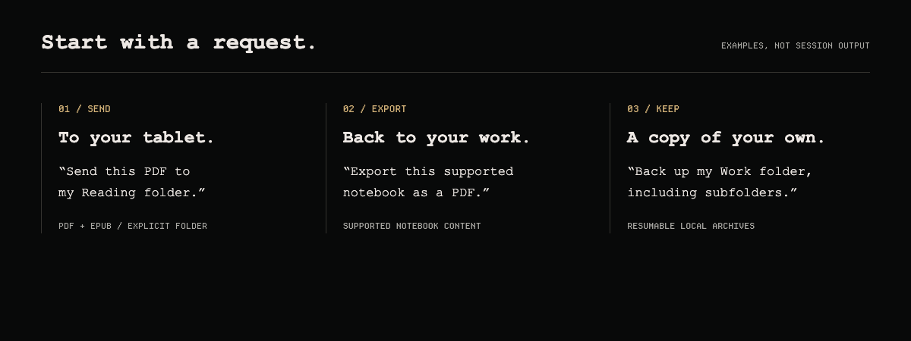

# reMarkable for Hermes

Send documents to your tablet. Bring your notes back into reach of your agent.


Browse your library, send PDFs and EPUBs to a chosen folder, export supported notebook pages, and keep a resumable local backup—all from Hermes.

## Less moving files. More working with them.



- **Send:** upload PDF/EPUB files to an explicit folder.
- **Bring back:** download originals or full archives; render supported notebook pages as PDF or PNG.
- **Find:** browse folders and tags, or search native typed text in selected documents.
- **Keep:** resume a local archive backup without deleting local copies when remote notes disappear.

## Connect your tablet

Requires **Hermes 0.21.3+**, **Node.js 22+** and **npm**.

```bash
hermes plugins install https://github.com/cygnostik/hermes-plugin-remarkable
hermes plugins enable remarkable
```

Then run these in **your own terminal**:

```bash
hermes remarkable setup-cloud
hermes remarkable enroll
hermes remarkable status
```

Enrollment opens the account-pairing page and accepts the one-time code in a masked local prompt. Never paste that code into chat. Start a new Hermes conversation, then ask:

> Show my reMarkable folders.

Cloud setup explicitly installs the pinned Node sidecar; it does not run during plugin import. Uploads send the local PDF/EPUB you authorize to your reMarkable account. Device credentials remain in the Hermes profile, outside the plugin installation; the plugin does not encrypt them. Protect that directory and keep credentials out of bug reports.

## Before exporting a notebook

**Typed-text extraction is not handwriting OCR.** Native rendering supports a defined subset of notebook content; standard ruled templates and several newer scene features remain unsupported. The plugin reports unsupported content rather than silently omitting it. Originals, archives and rendered exports are different outputs.

Rendering is optional and requires **uv** plus a separate environment:

```bash
hermes remarkable setup-renderer
```

Check the [compatibility matrix](GUIDE.md#native-rendering-compatibility), [tested-platform evidence](ACCEPTANCE.md) and [dependency licenses](THIRD_PARTY_NOTICES.md) first. PyMuPDF uses AGPL/commercial licensing. For unsupported notes, preserve the archive and use an official export.

Cloud is the default. USB and SSH remain explicit preview transports, off by default—not automatic fallbacks.

[All 12 tools, configuration and troubleshooting](GUIDE.md) · [Issues](https://github.com/cygnostik/hermes-plugin-remarkable/issues) · [Release notes](RELEASE_NOTES.md)

---

A community plugin by **Chris M. · [ProDyn.ai](https://prodyn.ai)**. Unofficial; not affiliated with or endorsed by reMarkable AS or Nous Research. The header is editorial artwork; the request panel shows examples, not a live session.

[MIT](LICENSE) · [Third-party notices](THIRD_PARTY_NOTICES.md)
